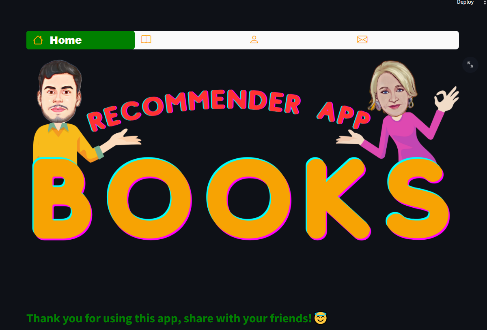
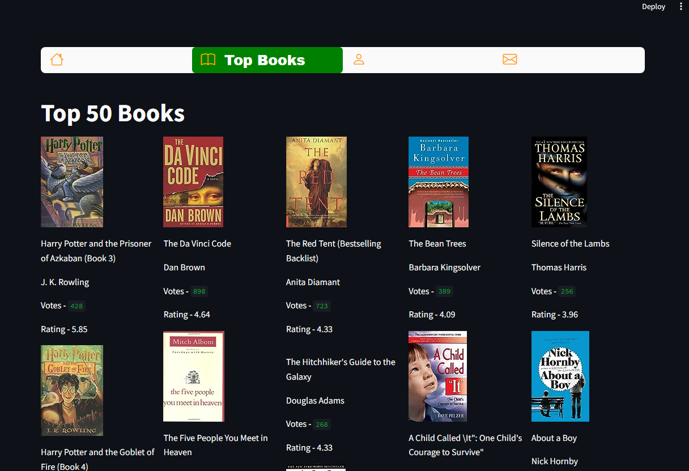
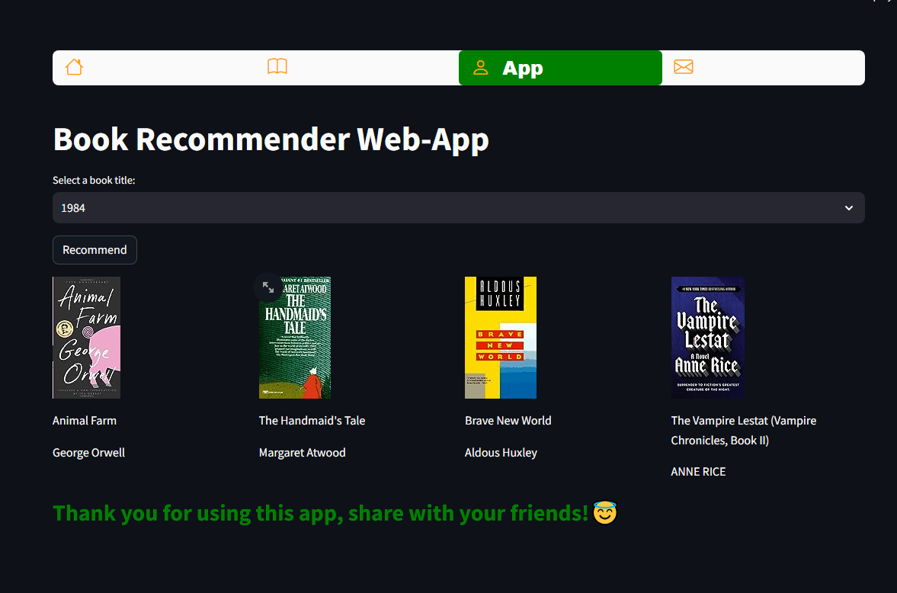
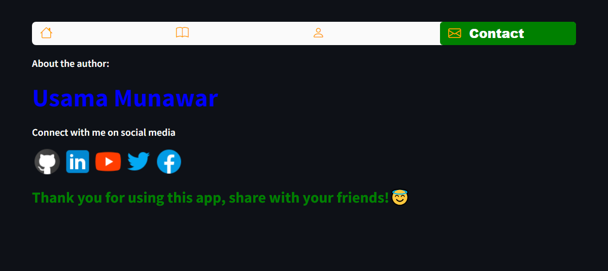

# 📚 Book Recommender Web-App

Welcome to the Book Recommender Web-App! 🚀 This web application uses collaborative filtering to recommend books based on user preferences.

## Features 🌟

- Explore the **Top 50 Books** 📖 with images, titles, authors, votes, and ratings.
- Use the **Book Recommender** 📚 to get personalized book recommendations.
- Connect with the author and find them on social media. 📱

## App Usage 🚀
### 1. Home 🏠  
The "Home" page is the landing page of the Book Recommender   Web-App. Here, you'll find a welcoming image.
    
### 2. Top Books 📊
The "Top Books" page allows you to explore the top-rated books. You'll find a curated list of the top 50 books, complete with images, titles, authors, votes, and ratings. It's a great place to discover popular reads and decide which books to add to your reading list.

### 3. App 📖

The "App" page is where you can leverage the power of the Book Recommender. Here's how it works:

- **Select a book title:** Use the dropdown menu to choose a book title that you're interested in.

- **Click "Recommend":** Once you've selected a book title, click the "Recommend" button. The app will use collaborative filtering to analyze your choice and recommend other books that you might enjoy based on your selection.

- **Explore recommendations:** You'll receive a list of recommended books, complete with images, titles, and authors. Explore these recommendations to discover new books tailored to your preferences.
 
 ### 4. Contact 📱

The "Contact" page provides an opportunity to connect with the author of the app. Here's what you can do:

- **About the author:** Get to know the author through a brief introduction. You'll find information about the creator of the Book Recommender Web-App.

- **Connect on social media:** Connect with the author on various social media platforms, including GitHub, LinkedIn, YouTube, Twitter, and Facebook. Stay updated with the latest developments and insights.

## Author 👨‍💻

**Usama Munawar** 📝

Connect with me on social media:
- [GitHub](https://github.com/UsamaMunawarr) 🚀
- [LinkedIn](https://www.linkedin.com/in/abu--usama) 🌐
- [YouTube](https://www.youtube.com/@CodeBaseStats) 🎥
- [Twitter](https://twitter.com/Usama__Munawar) 🐦
- [Facebook](https://www.facebook.com/profile.php?id=100005320726463) 👍

## License 📜

This project is licensed under the MIT License - see the [LICENSE](LICENSE) file for details. 📄
